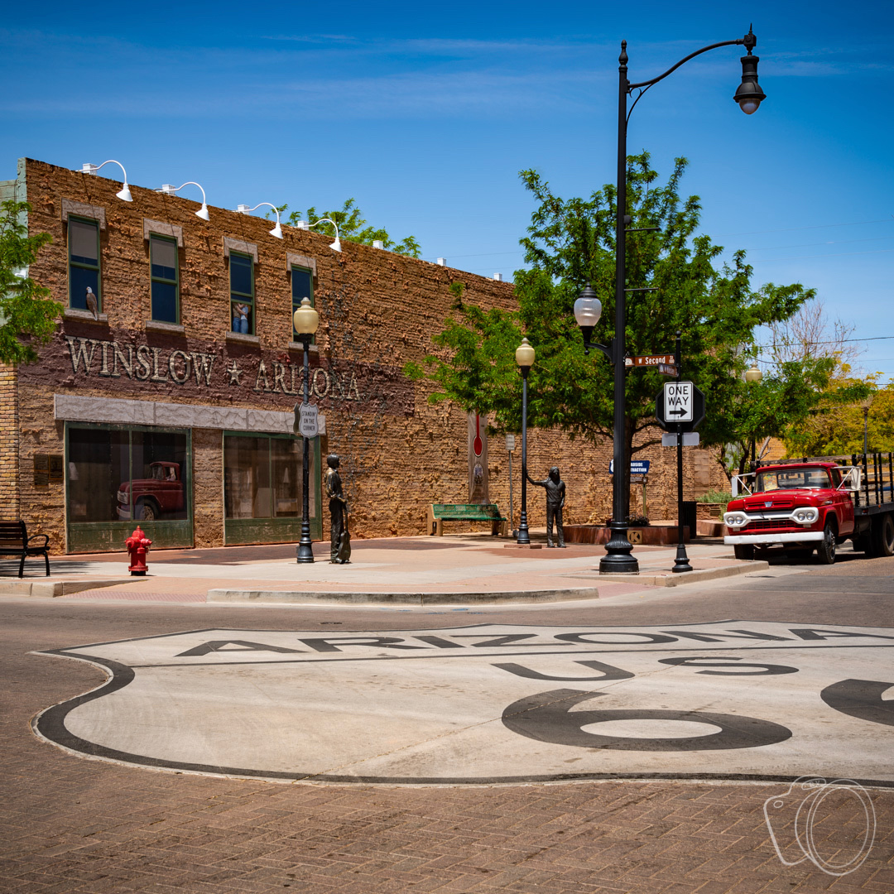
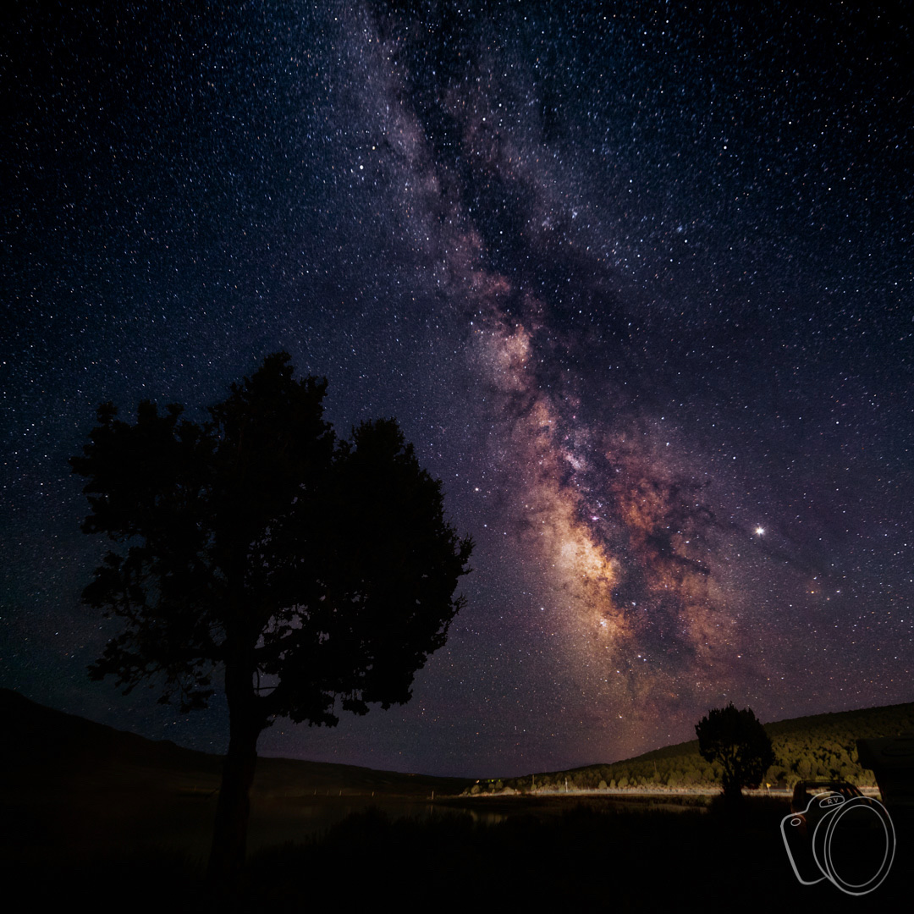
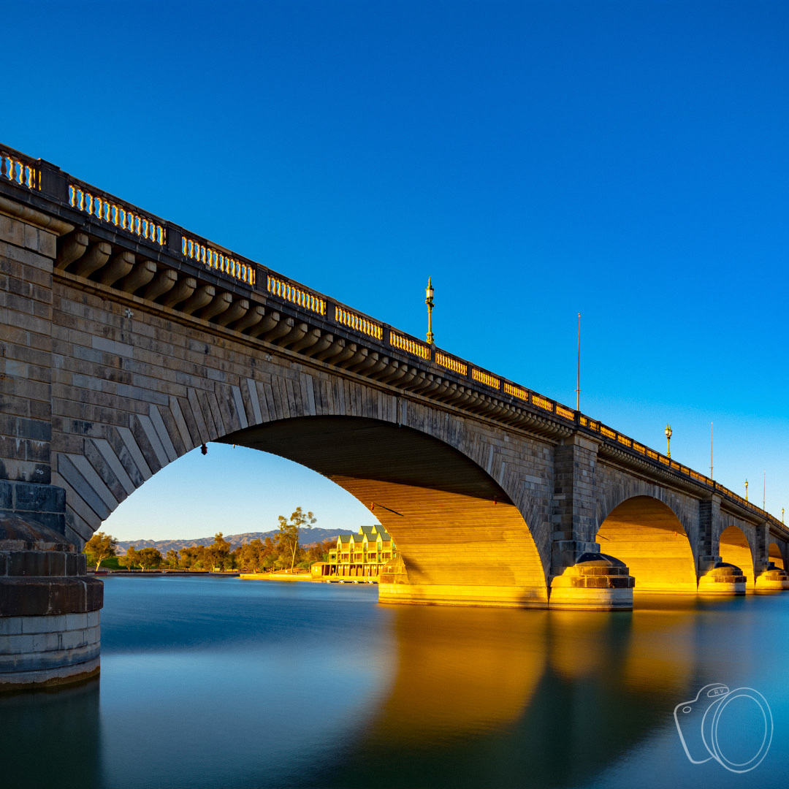

You can't get that Eagles song out of your head...so you make the journey to go stand on a corner in Winslow, AZ and see what all the fuss is about. However, when you arrive you quickly realize you were not the only person to have this notion.

This place is crawling with tourists--all day, every day. It's clear to see why, there are statues of Jackson Browne and Glenn Frey and a giant historic Route 66 sign painted in the intersection. Heck, there's even a girl, my lord, in a flatbed Ford! What's not to love?

"Wait a minute," you say, "where is everyone?"

Oh, they were there, but with some planning and a little Photoshop magic they disappeared from the final image.

Today, I'm going to share the process with you. Any camera that can be held stationary will work. This could be a big fancy DSLR on a tripod or just your phone propped up someplace.

Stick with me to the end for some Bonus Tips on other situations where this technique works!

### The Basic Concept

If you've ever tried removing unwanted items (like tourists!) from a single photo you know how much work it is. If you haven't, trust me, it's awful. This is **NOT** that!

Instead, the idea is to simply take lots of photos of the same scene. Objects moving through the scene (like tourists!) will reveal different parts of the scene over time.

Photoshop can then take this stack of photos and reveal the scene minus the objects moving in front of it. Automatically. Like magic!

### Taking the Photos

I said you need "lots" of photos...but how many is that exactly?

Here comes everyone's favorite answer: _it depends_. While this is definitely a fact, I can do better than leave you there.

Essentially, you need a clear view of all the parts of the scene you want in the final image. If a place is especially crowded, it will take more photos than a place with fewer people. Are people lingering? If so, this process will take more time, and maybe more photos.

You can take too few, but you can't take too many.

Well, you can kind of take too many. The processing in Photoshop is somewhat intense. More images means more processing time. A _lot_ more in some cases.

Ideally, somewhere between 15 and 50-60 photos should do it.

Definitely use a tripod (or equivalent). You really don't want the camera to move. This simplifies the processing needed later on. Photoshop _can_ align your images automatically, but this process is very slow. Much better to make a stable set up and skip that step if possible.

### Full Auto or Selective Fire

Should you automate taking the photos? By that, I mean using an intervalometer or your camera's built-in timer to take the shots.

Sometimes this is the way to go. If the objects (like tourists!) are steadily moving through the scene without any lingering then it works well. Get yourself a coffee and relax while the camera does the work.

More often, though, I find that this is not the case, and it wasn't in Winslow. People were spending 15-30 seconds posing for pictures. One couple sat on that bench (near the center of the photo) for over half an hour (that required a spot fix which I'll cover later).

In this case, still get a coffee, but then prepare to be patient. Remember that the goal is to get all the parts of the scene you're interested in on at least a few photos. I'll repeat that...everything you want in the final image must be captured in at least a few photos.

Thus the idea is to be opportunistic in capturing photos as bits and pieces of the scene are revealed.

This can take some time, but it is still much faster and infinitely easier than trying to edit objects (like tourists!) out of your photos manually.

Note that some kind of remote shutter release is highly recommended for this to keep the camera as still as possible. **iPhone/iPad users**: Did you know that your wired earbuds can be used as a remote shutter release? Just have them plugged in, open the camera app, and use the volume buttons to shoot. Up or down, it's up to you, either works!

### Loading Your Images (Lightroom Classic)

This section covers opening your images in Photoshop for readers that also use Lightroom Classic. Skip to the next section if you don't use Lightroom.

Import your photos into Lightroom as you normally would. Once the import process is complete, simply select all the photos, then right-click and select "Open as layers in Photoshop." This will take a few moments.

It is up to you whether you do any processing in Lightroom prior to passing the images to Photoshop. I personally like to apply lens corrections before sending to Photoshop.

Whatever edits you do make, it is important that all images receive the same treatment. The best way is to make edits to just a single frame and then synchronize those edits to the others.

### Loading Your Images (Photoshop only)

This section covers opening your images in Photoshop for readers that don't use Lightroom. Skip this section (and read the previous one) if you use Lightroom.

Import your photos to your computer as you normally would, and put them all in an empty folder. It is important to not have anything else in the folder except the photos you intend to combine. Once you have all the photos on your computer, launch Photoshop.

Photoshop provides automation for loading these images exactly how we want. We've worked hard enough collecting these photos, right? When you feel rested enough, go to `File` -> `Scripts` -> `Load Files into Stack...`. Select `Folder` from the `Use` drop down, then `Browse...` to the folder you put the images in. Click `OK` and Photoshop will do it's thing. It will take a few moments. More than a few if you have a lot of images.

### Get Smart

At this point you should have Photoshop up and each of your images loaded into its own layer.

We will now create an image stack by selecting all the layers and converting them to a Smart Object. To select all the layers, go to the `Select` menu and choose `All Layers`. Then, go to the `Layer` menu and choose `Smart Objects` -> `Convert to Smart Object`. This will take a few moments.

Just like that, we've arrived at the moment everyone has been waiting for. This is the step where moving objects (like tourists!) will magically disappear! Go back to the `Layer` menu and choose `Smart Objects` -> `Stack Mode` -> `Median`. And then...well, be patient, man. Magic takes time.

After the interminable wait, you will be rewarded with a clean view of your scene! Congratulations!

### Tips for Best Results

You will achieve good results with what we've covered so far. Now I'll share some tips for getting great results.

#### Go Manual

Use a manual mode on your camera, if possible. Do this because this process works the best when every image is the "same" from the point of view of exposure, white balance, etc. I know this isn't possible with all cameras, especially phones. If you can't go manual, be aware that you'll get better results in steadier conditions (where the automatic mode of your camera is likely to keep choosing the same settings). Pick your spots appropriately.

#### Use a Reference Shot(s)

I use this tip nearly every time I use this technique.

A reference shot is the one that has the best version of something in it. For me, this is usually the sky.

While this process produces amazing results with minimum effort, it does not discriminate when it comes to moving objects. Like clouds. The sky tends to get smeared around in the process of exterminating tourists.

Because of this, I usually go through all the shots and pick the best sky. Once I find the one I like, I use it to replace the sky in the final image.

Of course, you can use this tip multiple times on the same image, using the same or different reference shots to draw from.

You may remember that I mentioned that couple on the bench. They were there when I started shooting. I knew they weren't going to disappear because they were in every shot I had. After I had enough shots for the rest of the scene I had to wait for them to finally get up to get a clean shot of the bench. After all was said and done I was able to blend the clean bench in manually.

#### Practice!

Don't wait until you're standing in front of the Taj Majal to try this for the first time! Pack up your gear, head to a local park, and put in some reps disappearing people.

I've described the technique here, but you won't get a feel for it until you put it into practice. You'll soon find that you can guess how many shots you need to get what you want, etc. You'll be happy for that confidence when it's time for the real thing.

### Bonus Tips! (Other Times to Use This)

Essentially, this technique boils down to noise reduction. We reduced the noise (tourists!) and increased the signal (the scene). This applies to many situations.

Astrophotographers use this technique for every image because they are working with such dark images. There is very little signal, and thus noise is more apparent.

This is true of any low-light photography. Try it next time you take something like a night city scene or a moonlit lake.

You can use this technique to simulate long exposures. This is especially handy in situations when a long exposure isn't possible, like in bright sunlight (without an ND filter).

This is the London Bridge ([in Arizona, of course!](<https://en.wikipedia.org/wiki/London_Bridge_(Lake_Havasu_City)>)). The water was quite choppy the day this was taken and would have resulted in a very busy, distracting foreground. Thirty images were combined using the technique described in this post to simulate a long exposure. This softened the water and let the majesty of the bridge shine through.

It works well with waterfalls and other flowing water where you want to show a little motion. One advantage to this technique over a traditional long exposure is the ability to try different exposure lengths in post by combining more or fewer photos. The sky is the limit, use your imagination!
